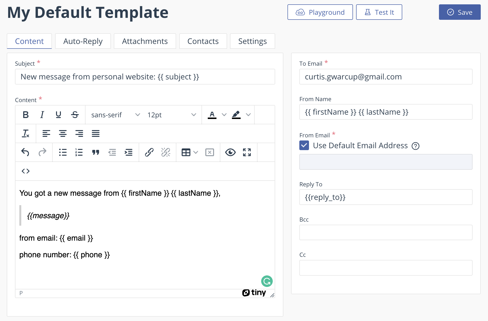

# Nextjs Tailwind Personal Website

This is a [Next.js](https://nextjs.org/), [Tailwind CSS](https://tailwindcss.com/) starter template intended to be used as a portfolio or personal website. It comes out of the box configured with the latest technologies, tools, and best practices. It's built to be easily configured, customized and extended. It's also fully responsive and mobile friendly.

Visit the [demo](https://nextjs-tailwind-portfolio-cwarcup.vercel.app/).

<div align="center">
  
</div>

<details>
<summary>
📈More screenshots
</summary>
<div align="center">
  

  

  

</div>
</details>

It's built with the latest technologies and tools, fully responsive and mobile friendly, and has a built in dark/light mode, so you can be sure that your website will look great on any device.

Inside of `data/siteMetadata.js` you'll find a JSON object to easy change the websites data. You can add your name, title, description, social media links, and more. 

```js
const siteMetadata = {
  title: 'Best Nextjs Tailwind Portfolio',
  description:
    'This is where you can learn about me and my work. I am a full stack developer and I love to build things.',
  author: 'Curtis Warcup',
  authorHeadline: 'Full Stack Developer, Open Source Enthusiast',
  authorAbout:
    "Hi, I'm Curtis, a full stack developer. I created this to help my mom create a website for all her crazy business ideas. I hope you like it!",
  authorAboutExtended:
    "Curtis is a Canadian-born, living in beautify Vancouver, BC. \n \n In his personal life, Curtis is an avid cyclist and health nut. He enjoys making weekly meal preps and running with his dog. When he's not coding, exercising, or cooking, Curtis can be found in various mechanical keyboard enthusiast forums, scoping out his next purchase.",
  socials: {
    twitter: 'https://twitter.com/curtiswarcup',
    github: 'https://github.com/Cwarcup',
    linkedin: 'https://www.linkedin.com/in/curtiswarcup/',
    instagram: 'https://www.instagram.com/curtiswarcup/',
    facebook: 'https://www.facebook.com/curtiswarcup',
  },
  //...
}
```

## Getting Started

Select which branch you want to use. There are two branches available at the moment:

Clone the repository and install the dependencies:

```bash
npm install
```

Run the development server:

```bash
npm run dev
```

Open [http://localhost:3000](http://localhost:3000) with your browser to see the result.

## Branches

I plan on creating multiple branches with different features and configurations. If you have any suggestions, please let me know.

### Main

This is the main branch. It contains the most basic configuration and features.This includes a basic layout, a few pages, and a few components.

### Personal Site

This branch is for those who want to use this as a personal site. It serves as a site to showcase your work experience, skills, and get in touch with you.

#### Email Form

This branch is setup with [emailJS](https://www.emailjs.com/) to send emails from your site. It also includes a contact form and a few pages. In order to use use emailJS, you will need to create an account and add your credentials to the `.env` file. See the [emailJS docs](https://www.emailjs.com/docs/) for more information on how to do this.

Here is an example of the emailJS template I used. You can use this as a starting point for your own template, but make sure you update the `templateParams` to match your own template.



### Developer Portfolio - Coming Soon

This branch is for those who want to use this as a developer portfolio. It serves as a site to showcase your projects, skills, and get in touch with you.


## Deploy on Vercel

The easiest way to deploy your Next.js app is to use the [Vercel Platform](https://vercel.com/new?utm_medium=default-template&filter=next.js&utm_source=create-next-app&utm_campaign=create-next-app-readme) from the creators of Next.js.

Check out our [Next.js deployment documentation](https://nextjs.org/docs/deployment) for more details.

## Nitty Gritty

### Icons

This project uses [React Icons](https://react-icons.github.io/react-icons/) for icons, specifically the [Remix Design Icons](https://react-icons.github.io/react-icons/icons?name=ri). If you need the svg files, you can find them [here](https://github.com/Remix-Design/RemixIcon/tree/master/icons).

### Favicons and Head Tags

Use [Favicon.io](https://favicon.io/favicon-converter/) to generate your favicon and add the generated code to the `pages/_document.js` file. Make sure you download the generated files and add them to the `public` folder. You will need to create an image for [Favicon.io](https://favicon.io/favicon-converter/) to use. I recommend using [Canva](https://www.canva.com/) to create your image.

### Customizing Colors and Dark/Light Mode

This project uses [Tailwind CSS](https://tailwindcss.com/) for styling. You can customize the colors and dark/light mode by editing the `tailwind.config.js` file. See the [Tailwind CSS docs](https://tailwindcss.com/docs/customizing-colors) for more information on how to do this.

In short, you find something that looks like this in the `tailwind.config.js` file:

```js
  //...
    extend: {
      colors: {
        primaryText: colors.zinc,
        accent: colors.sky,
        gradientStart: colors.sky,
        gradientEnd: colors.stone,
      },
    },
  //...
```

The `colors` object is where you can add your own colors. You can use the [Tailwind CSS color palette reference](https://tailwindcss.com/docs/customizing-colors#color-palette-reference) to find the colors you want to use.

For example, if you wanted to change the `primaryText` color to `blue`, you would change it to this:

```js
  //...
    extend: {
      colors: {
        primaryText: colors.blue, // <-- Change color name here
        accent: colors.sky,
        gradientStart: colors.sky,
        gradientEnd: colors.stone,
      },
    },
  //...
```

## Road map

- [ ] Customize sections
  - [X] Gerneral Info
  - [X] Header Links
  - [X] About section
  - [X] Resume section
    - [X] Experience section
    - [X] Education Section
  - [X] Projects sections
  - [X] Contact Section
    - [X] Contact Form with MailJS
    - [x] Social links
  - [X] Footer customizations
- [ ] Update `pages` to use next 13 `app`, `page`, and `layout` components.
- [ ] Typescript support
- [ ] Add a blog page and generate an RSS feed
  - [ ] syntax highlighting
  - [ ] markdown support

